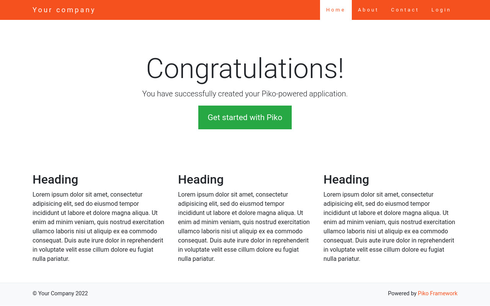

# Getting Started

To quickly test or start a new Piko based project, the recommended way is to use the [Piko project skeletton](https://github.com/piko-framework/piko-project).

## Piko project skeletton installation

If you don't have Composer installed on your system, you may install it by following the instructions
at [getcomposer.org](http://getcomposer.org/doc/00-intro.md#installation-nix).

Then install your project template using the following command:

```bash
composer create-project piko/project yourprojectname
```

### Run your app

Once the project installed (see above), you can run it using the PHP built-in web server :

```bash
cd yourprojectname && php -S localhost:8080 -t web
```

You should see the interface bellow in your Web browser if you go to [http://localhost:8080/](http://localhost:8080/)



## Hello world example

Once the project created (see above) create a new controller file in `modules/site/controllers` named `HelloController.php`.

and edit the file with this code :

```php
<?php
namespace app\modules\site\controllers;

class HelloController extends \piko\Controller
{
    public function worldAction()
    {
        return "<h1>Hello world!</h1>";
    }
}

```

Then open the URL : [http://localhost:8080/site/hello/world](http://localhost:8080/site/hello/world)

You should see `Hello world!' in your browser.

The URI `/site/hello/world` corresponds by default to the module `site`, the controller `hello` and the action `world`.

It's possible to customize the URI by editing the file config.php and add a new route like this :

```php
<?php
return [
    // ...
    'components' => [
        'router' => [
            'class' => 'piko\Router',
            'routes' => [
                //...
                '/hello-world' => 'site/hello/world',
                '/:module/:controller/:action' => ':module/:controller/:action'
            ],
        ],
        // ...
    ]
];
```

You will obtain the same result than above with this URL : [http://localhost:8080/hello-world](http://localhost:8080/hello-world)

Rather than generate html code directly in the controller, it's possible to use a separate file.

Create a new file `world.php` in `modules/site/views/hello` (create before the directory hello) with this content :

```
<h1>Hello World!</h1>
```

In `modules/site/controllers/HelloController.php` we can rewrite the method `worldAction` like this :

```php
    public function worldAction()
    {
        return $this->render('world');
    }
```

This will render the content of the file `modules/site/views/hello/world.php`.

------

[How application works](application.md){: .btn .btn-orange }
