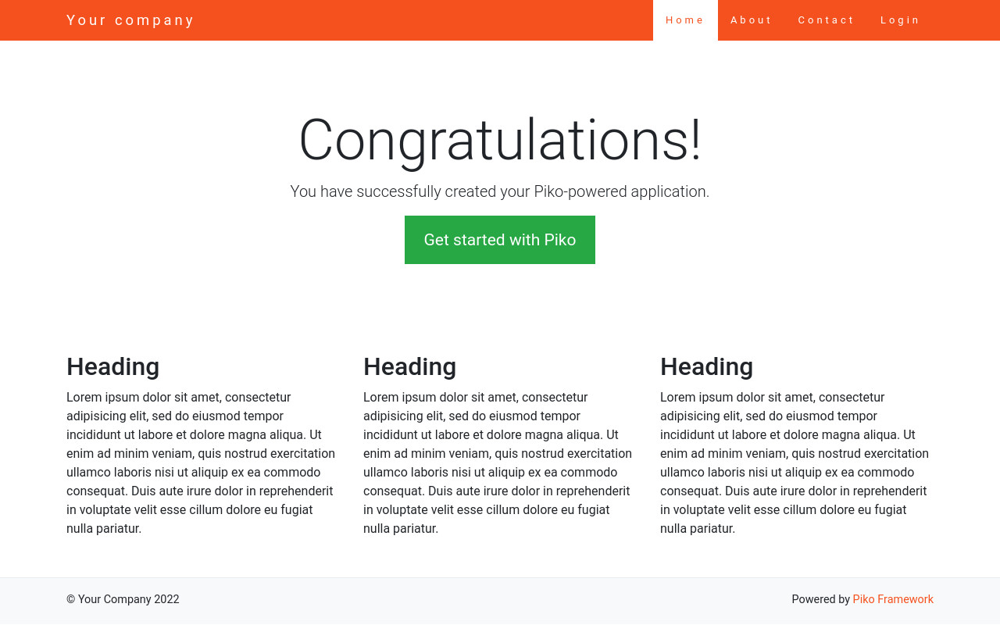

# Getting Started

The fastest way to create a new application with the Piko framework is to use the
[official Piko project skeleton](https://github.com/piko-framework/piko-project).

This getting started guide shows how to build a **modular application** based on
`Piko\ModularApplication`. For an overview of the modular architecture, see
[Modular application](modular-application/).

This guide walks you through:

1. Installing the Piko project skeleton
2. Running the application locally
3. Creating a simple **Hello World** page using a controller and a view

## Prerequisites

Before you start, make sure you have:

- **PHP** >= 8.0 (as required by the project skeleton)
- **Composer** (PHP dependency manager)

If Composer is not installed on your system, follow the instructions at
[getcomposer.org](https://getcomposer.org/doc/00-intro.md#installation-nix).

## Install the Piko project skeleton

Create a new project from the Piko skeleton using Composer:

```bash
composer create-project piko/project yourprojectname
```

This command will:

- Download the `piko/project` template
- Install its dependencies (including `piko/framework` and `piko/user`)
- Set up a PSR-4 namespace `app\\` for your application code

The resulting structure will look like this (simplified):

```text
yourprojectname/
├── config/
├── modules/
│   └── site/
│       ├── controllers/
│       ├── layouts/
│       ├── models/
│       └── views/
└── web/
    └── index.php
```

## Run the application

From the project root, start the PHP built-in web server and set the `web/` directory
as the document root:

```bash
cd yourprojectname
php -S localhost:8080 -t web
```

Then open [http://localhost:8080/](http://localhost:8080/) in your browser.

You should see a page similar to this:



> **Note**: For production deployments, you would typically configure a real web
> server (Apache, Nginx, etc.) to serve the `web/` directory as the document root.

## Hello World example

In this section you will:

1. Create a new controller
2. Access it through a URL
3. Add a custom route
4. Render the response using a view file instead of inline HTML

### 1. Create a controller

Inside your project, create a new controller file:

**File:** `modules/site/controllers/HelloController.php`

```php
<?php
namespace app\modules\site\controllers;

class HelloController extends \Piko\Controller
{
    public function worldAction()
    {
        return '<h1>Hello world!</h1>';
    }
}
```

The important points here are:

- The namespace `app\modules\site\controllers` matches the skeleton's
  PSR-4 configuration (`"app\\": ""` in `composer.json`).
- `HelloController` extends `\Piko\Controller`.
- The action method name `worldAction()` defines the **action ID** `world`.

### 2. Access the controller via URL

With the built-in server still running, open this URL in your browser:

[http://localhost:8080/site/hello/world](http://localhost:8080/site/hello/world)

You should see `Hello world!` rendered in the browser (inside the default layout).

By default, a URL of the form:

```text
/moduleId/controllerId/actionId
```

is mapped as follows:

- **Module**: `moduleId`
- **Controller**: `controllerId` → `Controller` class name is
  `ControllerIdController` (e.g. `hello` → `HelloController`)
- **Action**: `actionId` → method name is `actionIdAction`
  (e.g. `world` → `worldAction`)

So the URI `/site/hello/world` corresponds to:

- Module: `site`
- Controller: `HelloController`
- Action: `worldAction`

### 3. Define a custom route (optional, but recommended)

Instead of exposing the full module/controller/action path in the URL, you can
define a custom, shorter route.

Edit the route configuration:

**File:** `config/routes.php`

Add a new entry to the returned array:

```php
<?php

return [
    '/' => 'site/default/index',
    '/page/:page' => 'site/default/page',
    '/login' => 'site/default/login',
    '/logout' => 'site/default/logout',
    '/contact' => 'site/default/contact',

    // Custom route for the Hello controller
    '/hello-world' => 'site/hello/world',
];
```

Now the URL:

[http://localhost:8080/hello-world](http://localhost:8080/hello-world)

will produce the **same result** as
[http://localhost:8080/site/hello/world](http://localhost:8080/site/hello/world).

The router maps `/hello-world` to the internal route string `site/hello/world`,
which is then resolved to the `HelloController::worldAction()` method of the
`site` module.

### 4. Use a view file instead of inline HTML

Returning inline HTML from the controller works, but in most cases you will want
separate view files.

Create a new view file:

**Directory:** `modules/site/views/hello` (create the `hello` directory if it
does not exist)

**File:** `modules/site/views/hello/world.php`

```php
<h1>Hello world!</h1>
```

Now update your controller to render this view instead of returning raw HTML:

**File:** `modules/site/controllers/HelloController.php`

```php
<?php
namespace app\modules\site\controllers;

class HelloController extends \Piko\Controller
{
    public function worldAction()
    {
        return $this->render('world');
    }
}
```

What happens here:

- `$this->render('world')` looks for a view file named `world.php` in the
  controller's view directory.
- For `HelloController`, the view path resolves to
  `modules/site/views/hello` (derived from the controller ID `hello`).
- The rendered view content is then wrapped into the module/application layout
  (by default `modules/site/layouts/main.php`).

You now have a basic **MVC flow**:

1. The browser requests `/hello-world`.
2. The router matches it to the internal route `site/hello/world`.
3. The `site` module creates `HelloController` and calls `worldAction()`.
4. The controller renders the `world` view.
5. The application wraps the view with the default layout and returns the
   HTTP response.

---

[How application works](modular-application/index.md){: .btn .btn-orange }
